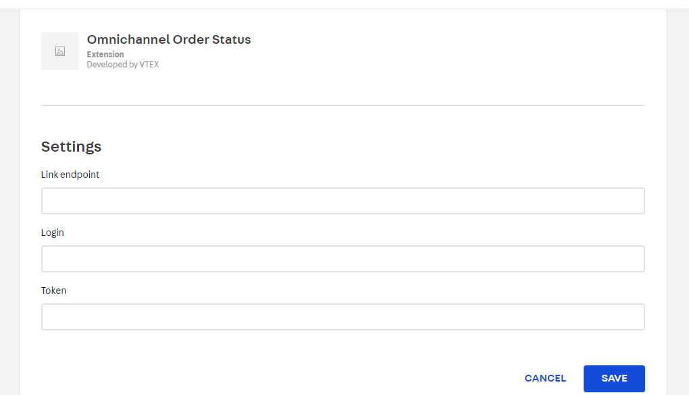

# Omnichannel Order Status

Allows customers to view order status on standardized external APIs

## Installation

Install this app in your workspace

```js
vtex install vtex.ominichannel-order-status@0.0.1
```

Access your url store in admin area:

https://{workspace--{accountname}.myvtex.com/admin

## In Account Settings (/admin)

1 - Go to My Apps and find for "Omnichannel Order Status"
2 - Install it.
3 - Set informations (link endpoint, login and token) for communication with service.



The application will communicate with the external api based on login, token and url api.

### Endpoint

To work properly, your api must have this following endpoints:

<details><summary>POST: api/v1/pedido/pesquisa</summary>

Search for orders in ERP. The site will fill only one of the objects: PorPeriodo, PorCodigo or PorNotaFiscal.

Request Format

```
{
  "revendaId": number,
  "porCodigo": {
    "codigo": string,
    "tipo": number (PedidoId: 0, PedidoClienteId: 1, PedidoErpId: 2)
  },
  "porPeriodo": {
    "dataInicial": Date,
    "dataFim": Date
  },
  "porNotaFiscal": {
    "notaFiscal": string,
    "serieNotaFiscal": string
  }
}

```

Response Format

```
{
  "itens": [
    {
      "pedidoErpId": string,
      "pedidoClienteId": string,
      "totalPedido": number,
      "status": number,
      "dataPedido": Date,
      "observacao": string,
      "notaFiscal": string,
      "serieNotaFiscal": string,
    }
  ]
}

```
</details>

<details><summary>GET: api/v1/pedido?pedidoErpId={pedidoErpId}&revendaId={revendaId}</summary>

Gets the details of an order directly from the ERP.

Request Format

```
{
  pedidoErpId: string
  revendaId: number
}

```

Response Format

```
{
  "pedidoErpId": string,
  "status": 0,
  "itens": [
    {
      "partNumber": string,
      "descricaoDoProduto": string,
      "quantidade": decimal number,
      "valorUnitario": decimal number,
      "valorTotal": decimal number,
      "comissao": decimal number
    }
  ],
  "revendaId": 2,
  "clienteFinalId": string,
  "clienteFinalCnpj": string,
  "clienteFinalCpf": string,
  "valorFrete": decimal number,
  "valorTotalPedido": decimal number,
  "dataPedido": Date,
  "dataPrevisaoEntrega": Date,
  "observacao": string,
  "notaFiscal": string",
  "serieNotaFiscal": string,
  "linkTransportadora": string,
  "formattedAddres": string,
  "zipcode": string,
  "methodPayment": string,
  "corpname": string,
  "corpemail": string,
  "cityState": string,
  "methodPaymentInfo": string,
  "centrosDeDistribuicao": [
    {
      "distributionCenterPrefix": string,
      "itens": [
        {
          "partNumber": string,
          "descricaoDoProduto": string,
          "quantidade": decimal number,
          "valorUnitario": decimal number,
          "valorTotal": decimal number,
          "comissao": decimal number
        }
      ],
      "valorFrete": decimal number,
      "valorTotalCD": decimal number
    },
    {
      "distributionCenterPrefix": string,
      "itens": [
        {
          "partNumber": string,
          "descricaoDoProduto": string,
          "quantidade": decimal number,
          "valorUnitario": decimal number,
          "valorTotal": decimal number,
          "comissao": decimal number
        }
      ],
      "valorFrete": decimal number,
      "valorTotalCD": decimal number
    }
  ]
}

```
</details>

<details><summary>POST: api/v1/pedido/arquivo</summary>

[OPTIONAL] Send a file sent by the user to the ERP

Request Format

```
{
  "url": string,
  "pedidoErpId": string,
  "tipoDeArquivo": string
}

```

Response Format

```

```
</details>

<details><summary>GET: api/v1/arquivospedido?pedidoErpId={pedidoErpId}&revendaId={revendaId}</summary>

[OPTIONAL] From the order id in Erp, the file references must be returned.

Request Format

```
{
  pedidoErpId: string
  revendaId: number
}

```

Response Format

```
{
  "pedidoErpId": string,
  "itens": [
    {
      "tipoArquivo": number (SegundaViaBoleto: 0, SegundaViaTransferencia: 1, Xml: 2, Danfe: 3, NumeroDeSerie: 4, GARE: 5, GNRE: 6, Outros: 7),
      "descricao": string,
      "url": string"
    },
    {
      "tipoArquivo": number,
      "descricao": string,
      "url": string"
    }
  ]
}

```
</details>

